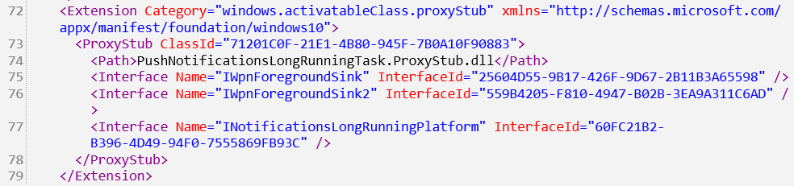

[WinAppSDK API Spec](https://github.com/microsoft/WindowsAppSDK/blob/main/specs/dynamicdependencies/DynamicDependencies.md)


## Package Dependency

Windows MSIX Package 目前来看主要有三种：
* Application Package，使用 `<Application Executable="Path" />` 定义入口程序。
* Framework Package，设置 `<Framework>true</Framework>`。
	* WinUI2、WinAppSDK、DirectX、VCLib 等。
* Resource Package，包含字符串、图像等资源。
	* 最常见的用例是按需下载的语言包。

第一个容易理解，然而后两者怎么起作用初看会令人困惑。实际上这是基于 MSIX Package Dependency 机制的。我们下面使用一个例子来解释它是怎么工作的。

AppxManifest.xml 中可以设置 `<Dependencies />`，例如 WinUI3Gallery 应用拥有以下依赖：

```xml
<Dependencies>
    <TargetDeviceFamily Name="Windows.Desktop" MinVersion="10.0.19041.0" MaxVersionTested="10.0.19041.0" />  
    <PackageDependency Name="Microsoft.WindowsAppRuntime.1.3" MinVersion="3000.820.152.0" Publisher="CN=Microsoft Corporation, O=Microsoft Corporation, L=Redmond, S=Washington, C=US" />  
    <PackageDependency Name="Microsoft.VCLibs.140.00" MinVersion="14.0.30704.0" Publisher="CN=Microsoft Corporation, O=Microsoft Corporation, L=Redmond, S=Washington, C=US" />  
    <PackageDependency Name="Microsoft.VCLibs.140.00.UWPDesktop" MinVersion="14.0.30704.0" Publisher="CN=Microsoft Corporation, O=Microsoft Corporation, L=Redmond, S=Washington, C=US" />  
</Dependencies>
```

可以看到，除了第一个是指定操作系统版本之外，后三个都是指定框架包依赖。但其实它们之间也有区别。

* `Microsoft.WindowsAppRuntime.1.3` 是 WinAppSDK 的框架包，它是一个 WinRT API 框架，用户程序通过 ActivationFactory 获取其接口。但是默认 WinRT 是按 COM 激活，也即本质是基于注册表激活的，怎么基于包激活呢？其 AppxManifest.xml 中含有
	* `<Extension Category="windows.activatableClass.inProcessServer" />`，表示可激活的 WinRT DLL 与 Class 的从属关系。
	* `<Extension Category="windows.activatableClass.proxyStub" />`，表示一个 OutOfProc WinRT Server 的 RPC ProxyStub。可以想象到，这个 Server 肯定也是某个包里 XML 注册的，实际上语法就是 `<com:Extension Category="windows.comServer"><com:ComServer /></com:Extension>`。
	* 使用 XML 定义好这些之后，至少信息已经足以用于 WinRT Activation 了，并且通过包的元信息提供给 Windows 了，Windows 该做的就是按照包依赖反向注册，在激活时加以考虑，找到全部可能的激活路径。
	* 该机制一般被称为 PackagedCOM，详情可以看[这篇文章](https://blogs.windows.com/windowsdeveloper/2017/04/13/com-server-ole-document-support-desktop-bridge/)。
* `Microsoft.VCLibs.140.00` 和 `Microsoft.VCLibs.140.00.UWPDesktop` 都是 VC 运行库，一个给 UWP 一个给桌面用，其下包目录下全部都是 dll 。
	* 可以想见的是，在调用 `LoadLibrary` 时，搜索器会考虑 PackageDependency，从而使用到这个运行库。

有没有觉得这个机制很眼熟？没错，DLL、COM Server，介入 DLL Loader 和 COM 激活机制，Per-application 的 Manifest，这不就是 [WinSxS Assembly](https://learn.microsoft.com/en-us/windows/win32/sbscs/about-side-by-side-assemblies-) 吗？这不就是 Isolation 吗？倒也不用见怪，现代包管理都是殊途同归的，WinSxS 思想确实超前 NixOS 十年，只不过说不定人们都没发现某个方法其实是一大类问题的万金油。

不过 PackageDependency 并非只能做 Assembly 已经做到的事，它实际上在以下全部方面都起作用：

- DLL Loader - 在 [Dynamic-Link Library Search Order](https://docs.microsoft.com/windows/win32/dlls/dynamic-link-library-search-order) 中处于 CWD 之前，是旧的所有方法都找不到时才会考虑的选项。
- Common Language Runtime - .Net CLR 会直接在包依赖中寻找程序集加载，本质是 DLL Loader 的 .Net 版本，具体 Search Order 未知，应该也是最后的 Fallback 。
- COM - 上文都说了有 PackagedCOM 了，COM 的激活当然也是支持的。
- Windows Runtime - 上文也提到了，是通过 XML 定义激活元信息配置的。
	- 这里可以类比一下 CLR，因为 WinRT 本质就是 Windows 上的原生 CLR，连元信息（.winmd） 都用的是同一套（好像是经过 ECMA 标准化的）格式，可以用 ildasm.exe 查看。
	- 为什么 CLR 不需要 XML 配置呢？我猜测是因为 .Net DLL 里都包含了 .Net Assembly Metadata，也就是一个 .Net DLL 就等价于一个 Self-contained Package，其 Assembly Identity 是全局唯一的，可以用于直接识别。
	- 而 .winmd 和 IDL 可以互相转化，它没有 Assembly Identity （用 ildasm 可以看到基本是个空定义，我猜应该就是 placeholder ），而只有 Interface Definition。winmd 还是可组合的，一个包里可以有多个 winmd，可以说这些 winmd 分享了母包的 Package Identity 用于激活。
	- 那为什么 .winmd 不能像 CLR 一样，解析 metadata 来获得信息，非要我们手动配置 ActivatableClass？这个我其实……圆不回来了。我觉得大概率是 CLR 当然可以轻松解析 .Net DLL 内的信息，但是 WinRT Activation Factory 其实是二进制接口 (`RoGetActivationFactory`) + 字符串激活 (`HKLM\SOFTWARE\Microsoft\WindowsRuntime`)，为了激活性能的考虑，或者为了不在系统级 DLL 中引入一个有一些体积的 winmd parser 等，都有可能。
	- 文档里还提到了 WinRT Type Resolution 的流程就是给 Windows.* 开个洞，然后加上 PackageDependency，虽然没有强调，但他的意思是其它的一概不会考虑。这个忽略了注册表，我也不知道为什么会这么说。
- MRT / MRTCore - UWP 和 WinAppSDK 的两套资源管理系统，命名空间分别为 `Windows/Microsoft.Windows.ApplicationModel.Resources`，它们在解析时会把 PackageDependencies 划为不同的 ResourceMap 来访问，这也是 ResourcePackage 可以工作的原因。
- ms-appx URI 协议 - [ms-appx URIs](https://docs.microsoft.com/windows/uwp/app-resources/uri-schemes) 的 authority 部分可以填一个 Package Identity，如果为空就是 Package.Current，如果非空则会从 PackageDependencies 中解析。

除此之外，Dependency 还参与 Package Deployment，或者叫 Servicing（安装、更新与卸载）。例如假如一个 Framework 正在被某些应用依赖，它就不能立刻被更新，应该延迟到重启时等时候。涉及到版本以及卸载等情况的话就更复杂，这里必须要有一个严格并且鲁棒的引用计数机制，并且最好有保底机制存在。

这样解释下来应该可以看出 Package Dependency 的强大之处了，它是一个现代版的、和中上层抽象（WinRT、AppModel）紧密协作的 Isolation 机制。微软做这种东西已经得心应手（Windows Componentization Platform Servicing），所以这个现代版本还是相当 polish 的。

## 困境

产品矩阵

|Permission|Packaged|Unpackaged|
|-|-|-|
|App Container|UWP|Non sense|
|Desktop Non-elevation|MSIX|Win32 Native|
|Desktop Elevation|MSIX w/o PackagedCOM|Win32 Native|

由于众所周知的原因，在 Windows 上大部分应用处于并将长期处于 Unpackaged 状态，当然也就和 PackageDependency 无缘。这样一来微软想要推广自己的基于 Dependency 的 Framework Package 时就没法覆盖这部分开发者。

## Dynamic Dependency

为了让这些 Unpackaged 应用也能享受到 Package Dependency 的福利（这是主要原因），就需要提供一个方法给没有 Manifest 的应用告诉操作系统自己有什么 Dependency 。显然这个方法是运行时的，与 XML 描述的 Static Dependency 不同，所以它被称作 Dynamic Dependency。为了实现这一点，微软分了三步走

1. 推出 MSIX 支持桌面应用打包。
2. Windows DynamicDependency API (Win11 Only)，为 Unpackaged 应用做原生支持。
3. Windows App SDK DynamicDependency API (Down to Win10 1809)，类似于 androidx 或者 WinUI 3，用模拟的方式在用户态将最新平台功能下放到旧平台。

其中，1 不仅作为反向解决问题（消灭提出问题的应用）的办法，也作为 3 的基础。

实际上你可能要问了，Dependency 说到底也就是个存在内存中的图而已，修改一下到底有什么难的？其实这就是 2 的玩法，它修改了 Package Deployment 机制，让其对 Dynamic Dependency 有感知。具体做了什么？原本由于 Dependency 都是静态的，所以许多东西会被 Cache 下来，现在这些东西全部都要么废除 Cache，要么监听 Cache Invalidation（通过 Dependency Graph Revision Id，每次修改都会自增，使得 Cache 知道自己是旧的）。

下面重点讲讲 3 的玩法。DD 有两部分任务：

1. 保证 Dependency Effect，也即上面说的 DLL Loader 之类的。
	* 这些 Effect 也是库，Windows 喜欢用 dll 实现系统功能，本质就是一个用户态的库。具体到这里来说，对于 Dependency 的读取目前全部来自于两个 API：`GetCurrentPackageInfo` 和 `GetCurrentPackageInfo2`。同时，这些 Effect 还会用其他的一些 MSIX AppModel API 查询当前包的信息。
	* 如果我们 Hook 这些 MSIX AppModel API，假传圣旨，可以轻松假装当前进程是一个 Packaged 应用，并掺进我们的私货依赖，完全不用修改这些库的代码就可以让效果生效——
	* 是这样吗？上文我们说了以前静态的东西现在动态，很可能以前的 Cache 现在会失效，这个问题还是需要手动解决。
	* 很多机制并不叫做 Cache，但是本质是 Cache 。例如 DLL Search Order 会在进程创建时获取 PackageDependency 并计算一次 Order，此后再也不更新，这不是 Cache 胜似 Cache 。
	* 对于这种，只能从 Effect 本身下手，例如使用 `AddDllDirectory` API 手动修改。是个脏活，但也没办法，Hook 都出来了也不用考虑脏不脏的了。
2. 保证 Deployment Awareness，也即上面说的判断能否更新、一个旧版本的包能否被删除等场景。
	* 制造一个依赖框架包的假包 DDLM，使用者在自己应用启动时启动它。
	* 这也是 WinAppSDK 自己的做法，这个包由 WinAppSDK 主动提供。
	* 可以预见的是，Unpackged 应用在不主动制造假包，并且框架方也没有提供 DDLM，并且版本低于 Windows 11 的时候，Package Dependency 的 Deployment Awareness **没有办法被保证**。
